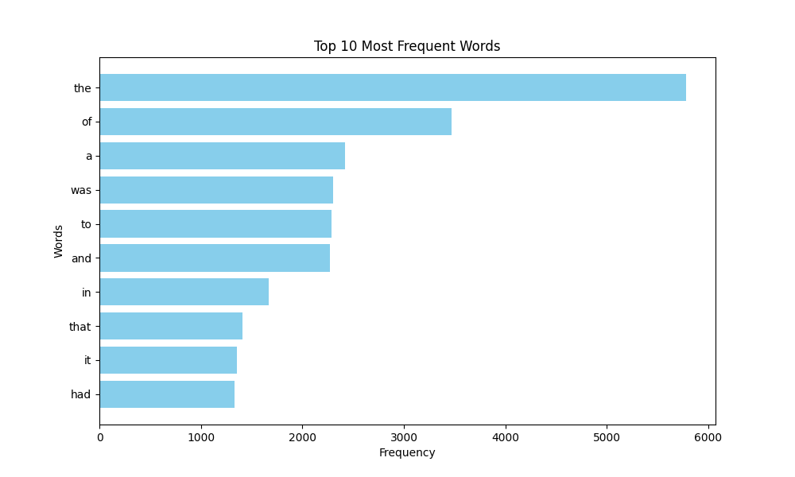

# Домашнє завдання до модуля “Асинхронна обробка”

## Завдання 1

Напишіть Python-скрипт, який буде читати всі файли у вказаній користувачем вихідній папці (source folder) і розподіляти їх по підпапках у директорії призначення (output folder) на основі розширення файлів. Скрипт повинен виконувати сортування асинхронно для більш ефективної обробки великої кількості файлів.

### Покрокова інструкція

1. Імпортуйте необхідні асинхронні бібліотеки.
2. Створіть об'єкт `ArgumentParser` для обробки аргументів командного рядка.
3. Додайте необхідні аргументи для визначення вихідної та цільової папок.
4. Ініціалізуйте асинхронні шляхи для вихідної та цільової папок.
5. Напишіть асинхронну функцію `read_folder`, яка рекурсивно читає всі файли у вихідній папці та її підпапках.
6. Напишіть асинхронну функцію `copy_file`, яка копіює кожен файл у відповідну підпапку у цільовій папці на основі його розширення.
7. Налаштуйте логування помилок.
8. Запустіть асинхронну функцію `read_folder` у головному блоці.

### Критерії прийняття

- Код виконує асинхронне читання та копіювання файлів.
- Файли розподілено по підпапках на основі їх розширень.
- Програма обробляє аргументи командного рядка.
- Усі помилки логовано.
- Код читабельний та відповідає стандартам PEP 8.

## Завдання 2

Напишіть Python-скрипт, який завантажує текст із заданої URL-адреси, аналізує частоту використання слів у тексті за допомогою парадигми MapReduce і візуалізує топ-слова з найвищою частотою використання у тексті.

### Покрокова інструкція

1. Імпортуйте необхідні модулі (`matplotlib` та інші).
2. Візьміть код реалізації MapReduce з конспекту.
3. Створіть функцію `visualize_top_words` для візуалізації результатів.
4. У головному блоці коду отримайте текст за URL, застосуйте MapReduce та візуалізуйте результати.

> 👉🏼 Наприклад, для топ 10 найчастіше вживаних слів побудова графіка може виглядати так:

### Критерії прийняття

- Код завантажує текст із заданої URL-адреси.
- Код виконує аналіз частоти слів із використанням MapReduce.
- Візуалізація відображає топ-слова за частотою використання.
- Код використовує багатопотоковість.
- Код читабельний та відповідає стандартам PEP 8.
